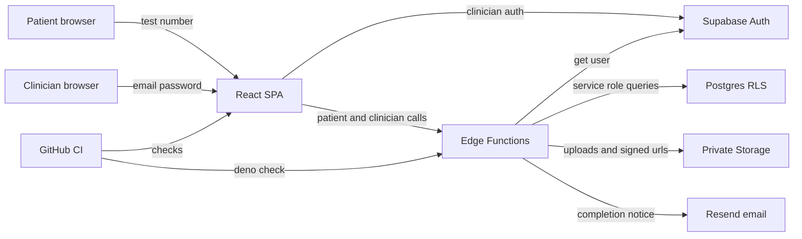

# Remote Assessment Project Threat Model

## Executive summary

The highest-risk areas are the patient test-number start boundary, token-scoped patient evidence APIs, clinician-only review/export APIs, private Storage signed URL issuance, and hosted Supabase drift. Because this is shared staging with invite-only clinicians and pilot/test data, confidentiality impact is lower than production clinical use, but the app still handles sensitive clinical-like profiles, raw drawings/audio, scoring reports, licensed stimuli, and service-role Edge Function access. The strongest existing controls are service-role server mediation, Supabase Auth for clinicians, RLS policies, private buckets, short-lived signed URLs, and start-attempt rate limiting; the main residual risks are invite enforcement, stale hosted schema/function drift, bearer token exposure on patient devices, evidence upload abuse, and broad service-role blast radius.

## Scope and assumptions

In scope:

- Runtime app: `client/` React/Vite browser app and `supabase/functions/` Edge Functions.
- Persistence and access control: `supabase/migrations/`, Supabase Auth, Postgres RLS, Storage bucket policies, and signed URL generation.
- Operational controls: `.github/workflows/ci.yml`, `docs/SUPABASE_RECONCILIATION.md`, `docs/LOCAL_E2E_VERIFICATION.md`, and related runbooks.

Out of scope:

- Local Claude worktrees under `.claude/worktrees/`.
- Licensed stimulus PDF source files that are intentionally outside Git.
- Supabase platform internals, CDN/TLS termination, and production WAF/CDN controls not represented in the repo.
- Browser extensions, compromised clinician devices, and malicious Supabase administrators.

Assumptions:

- Hosted Supabase project is shared staging, not disposable and not production.
- Clinician access is intended to be invite-only, even though local Supabase config allows signup.
- Current data is pilot/test data, but clinical data shapes and privacy guardrails should be treated as production-like design constraints.
- Local `main` is the target backend contract; hosted Supabase may drift and must be reconciled before hosted deploys.
- Clinician MFA/SSO/device policy is intentionally deferred for MVP.

Open questions that would materially change risk:

- Whether hosted staging currently contains real patient data rather than test/pilot data.
- Whether Supabase Auth signup is actually restricted in hosted staging through dashboard/provider settings.
- Whether ALLOWED_ORIGINS and PUBLIC_URL/SUPABASE_PUBLIC_URL are configured in hosted Edge Function secrets.

## System model

### Primary components

- React/Vite SPA (`client/`, `client/src/lib/supabase.ts`) uses Supabase anon key and calls Edge Functions.
- Supabase Auth validates clinician email/password sessions (`supabase/config.toml`, `client/src/app/store/AuthContext.tsx`, `supabase/functions/_shared/http.ts`).
- Patient start flow uses an 8-digit test number to call `start-session`, then receives `sessionId` and internal `linkToken` for task/evidence saves (`client/src/hooks/useSession.ts`, `supabase/functions/start-session/handler.ts`).
- Patient evidence APIs persist task JSON, drawing PNG/strokes, audio files, and completion/scoring state (`supabase/functions/_shared/submitResult.ts`, `save-drawing`, `save-audio`, `complete-session`).
- Clinician APIs read, review, score, and export sessions using clinician JWTs (`get-session`, `update-drawing-review`, `update-scoring-review`, `export-pdf`, `export-csv`).
- Supabase Postgres stores sessions, patients, task results, scoring reports, drawing/scoring reviews, audit events, notification events, and rate-limit attempts (`supabase/migrations/*.sql`).
- Supabase Storage stores private `stimuli`, `drawings`, and `audio` buckets served through signed URLs (`20260421000004_stimuli_storage.sql`, `20260424000001_drawings_storage.sql`, `20260426000001_enforce_private_audio_storage.sql`).
- Notification integration sends clinician completion emails through Resend when configured (`supabase/functions/_shared/notifications.ts`).
- CI runs lint, unit tests, coverage, build, and Deno checks (`.github/workflows/ci.yml`).

### Data flows and trust boundaries

- Clinician browser -> Supabase Auth: email/password and session tokens over HTTPS. Supabase Auth handles credential validation; local config shows email/password auth enabled, 1-hour JWT expiry, refresh token rotation, and MFA disabled.
- Clinician browser -> Edge Functions: bearer clinician JWT crosses from browser to service-role functions. `requireClinician` calls `supabase.auth.getUser` before clinician actions, and functions additionally filter by `clinician_id`.
- Clinician browser -> PostgREST: patient/profile reads and writes use Supabase client with RLS. Patient RLS policies constrain rows to `auth.uid() = clinician_id`.
- Patient browser -> `start-session`: unauthenticated 8-digit test number crosses the internet boundary. The function validates format, rate-limits hashed IP/code attempts, atomically consumes unused test numbers, and returns `linkToken`.
- Patient browser -> patient Edge Functions: `sessionId` and `linkToken` authorize task/evidence saves and completion. Functions query `sessions` by both values and require `status = in_progress`.
- Edge Functions -> Postgres/Storage: service-role key bypasses RLS, so each function must enforce app-level authZ before reads/writes. Evidence uploads are scoped under `<session_id>/<task>`.
- Edge Functions -> Storage signed URLs -> browser: private objects are converted into short-lived signed URLs for clinician review and patient stimuli. `sessionScopedObjectPath` constrains drawing/audio paths to the current session before URL generation.
- `complete-session` -> Resend: system sends completion email to clinician email from Supabase Auth admin API. Missing credentials cause skipped notifications; failures are recorded.
- Developer/CI -> build/test tooling: GitHub Actions installs dependencies, runs checks, and type-checks Edge Functions; it does not deploy hosted Supabase.
- Operator -> hosted Supabase: remote migrations/function deploys are controlled by `docs/SUPABASE_RECONCILIATION.md` and require explicit approval for remote-changing commands.

#### Diagram

## Assets and security objectives

| Asset | Why it matters | Security objective (C/I/A) |
|---|---|---|
| Clinician accounts and JWTs | Gate all dashboard, review, and export access | C/I |
| Patient test numbers and `linkToken`s | Authorize patient session start and evidence submission | C/I |
| Patient profile fields | Phone, DOB, gender, language, dominant hand, education years are sensitive clinical context | C/I |
| Pseudonymous case IDs | Intended to avoid patient names/national IDs but still link records | C/I |
| Raw task JSON | Drives scoring, review, and reports | I/C |
| Drawing/audio evidence | Sensitive behavioral/voice evidence and review source material | C/I/A |
| Scoring reports and clinician notes | Clinical interpretation and export content | C/I |
| Licensed stimuli | Licensed content must not be public or committed | C |
| Service-role key and provider secrets | Full backend/storage/admin capabilities | C/I |
| Audit and notification events | Incident reconstruction and operational delivery state | I/A |
| Hosted staging schema/functions | Must match app contract to preserve security assumptions | I/A |

## Attacker model

### Capabilities

- Remote unauthenticated attacker can load the SPA and call public Edge Function URLs.
- Remote attacker can guess or brute force patient 8-digit test numbers subject to rate limits.
- Patient with a valid test number can receive a `linkToken`, store it locally, and call patient APIs for that session.
- Invited clinician can authenticate and access their own dashboard sessions.
- Malicious or compromised clinician account may attempt cross-clinician access by changing `sessionId`, `reviewId`, export IDs, or storage paths.
- Network attacker can observe only if TLS or platform transport is misconfigured; TLS is assumed handled by Supabase/hosting.

### Non-capabilities

- Attacker cannot read service-role secrets from repo evidence; secrets are referenced through environment variables.
- Attacker cannot directly access private Storage objects without a valid signed URL or a permissive bucket/policy.
- Attacker cannot bypass Supabase Auth token validation unless Supabase Auth itself is compromised.
- Attacker cannot write hosted migrations/functions without repository or Supabase operator access.
- Malicious browser extensions and compromised endpoint devices are not modeled as preventable app-side threats.

## Entry points and attack surfaces

| Surface | How reached | Trust boundary | Notes | Evidence (repo path / symbol) |
|---|---|---|---|---|
| Clinician login/signup | SPA -> Supabase Auth | Internet -> Auth | Invite-only intent depends on hosted Auth settings; local config allows signup | `supabase/config.toml` `[auth]`, `client/src/app/store/AuthContext.tsx` |
| Session creation | `POST create-session` with clinician JWT | Clinician browser -> service-role Edge Function | Validates user, patient ownership, clinical profile, version/language | `supabase/functions/create-session/index.ts` |
| Patient start | `POST start-session` with 8-digit number | Unauthenticated internet -> Edge Function | Rate-limited, consumes `access_code`, returns `linkToken` | `supabase/functions/start-session/handler.ts`, `_shared/start-rate-limit.ts` |
| Stimulus manifest | `POST get-stimuli` with `sessionId` + `linkToken` | Patient browser -> Storage via Edge | Returns private signed URLs for licensed stimuli | `supabase/functions/get-stimuli/index.ts` |
| Task submit | `POST submit-results` with raw JSON | Patient browser -> DB via Edge | Validates task type and JSON size; token-scoped by session | `supabase/functions/_shared/submitResult.ts`, `_shared/tasks.ts` |
| Drawing upload | `POST save-drawing` with PNG data URL and strokes | Patient browser -> Storage/DB via Edge | Checks PNG signature and 7 MB base64 cap | `supabase/functions/save-drawing/index.ts` |
| Audio upload | `POST save-audio` with audio data URL | Patient browser -> Storage/DB via Edge | MIME allowlist and 20 MB base64 cap | `supabase/functions/save-audio/index.ts`, `_shared/tasks.ts` |
| Completion/scoring | `POST complete-session` with `sessionId` + `linkToken` | Patient browser -> scoring/report state | Server-side scoring is authoritative; sends notification | `supabase/functions/complete-session/index.ts` |
| Clinician session detail | `GET/POST get-session` with JWT | Clinician browser -> DB/Storage via Edge | Filters `clinician_id`, returns signed drawing/audio URLs | `supabase/functions/get-session/index.ts` |
| Review updates | `POST/PATCH update-*review` with JWT | Clinician browser -> scoring integrity boundary | Checks review session ownership before update | `supabase/functions/update-drawing-review/index.ts`, `update-scoring-review/index.ts` |
| CSV/PDF export | `export-csv`, `export-pdf` with JWT | Clinician browser -> report export | Filters sessions by clinician; PDF gated on final report | `supabase/functions/export-csv/index.ts`, `export-pdf/index.ts` |
| Storage buckets | Signed URL and storage policy paths | Edge -> Storage -> browser | Private buckets reasserted; old public audio policy is dropped | `20260421000004_stimuli_storage.sql`, `20260426000001_enforce_private_audio_storage.sql` |
| Remote deploy/migration | Supabase CLI/operator | Developer -> hosted Supabase | Drift is documented; changing remote requires approval | `docs/SUPABASE_RECONCILIATION.md` |
| CI checks | GitHub pull requests | Developer -> CI | No deployment; checks lint/unit/build/Deno | `.github/workflows/ci.yml` |

## Top abuse paths

1. Brute-force patient test numbers -> pass `start-session` -> obtain `linkToken` -> submit or complete someone else's pilot session -> corrupt assessment evidence and scoring.
2. Abuse open clinician signup in hosted staging -> create clinician account without invite -> access dashboard features for that account and probe APIs for cross-tenant weaknesses.
3. Steal or leak patient `linkToken` from localStorage/shared device -> replay patient save/complete calls while session is `in_progress` -> alter evidence before clinician review.
4. Upload oversized or many near-limit audio/drawing payloads through a valid patient token -> consume Edge Function CPU, Storage, and database write capacity -> degrade staging availability and increase costs.
5. Compromised clinician JWT -> call `get-session`/exports for own sessions -> exfiltrate profiles, raw evidence, scores, signed URLs, and export files.
6. Attempt cross-clinician access by changing `sessionId` or `reviewId` -> rely on Edge Function ownership filters and RLS -> access or modify another clinician's records if a function misses a filter.
7. Hosted Supabase drift leaves old public audio policy or missing functions deployed -> anonymous storage reads or broken review flows despite local code being secure.
8. Misconfigured `ALLOWED_ORIGINS` or public URL secrets in hosted staging -> browser clients receive permissive CORS or unusable signed URLs -> increases token exposure or breaks evidence review.
9. Notification provider failure or missing secrets -> clinician completion email skipped or failed -> delayed clinical review and unobserved staging reliability issues.

## Threat model table

| Threat ID | Threat source | Prerequisites | Threat action | Impact | Impacted assets | Existing controls (evidence) | Gaps | Recommended mitigations | Detection ideas | Likelihood | Impact severity | Priority |
|---|---|---|---|---|---|---|---|---|---|---|---|---|
| TM-001 | Remote unauthenticated attacker | Patient start endpoint is internet-reachable and accepts 8-digit numbers. Attacker can make repeated guesses from one or more IPs. | Brute-force or enumerate valid `access_code`, call `start-session`, and obtain `linkToken`. | Unauthorized start or corruption of a pilot session. Could expose scoring context and enable later evidence submission. | Test numbers, `linkToken`, task evidence, scoring integrity | Format check, one-time `link_used_at`, hashed attempt rows, IP/code rate limits. Evidence: `start-session/handler.ts`, `_shared/start-rate-limit.ts`, `20260426000002_patient_start_attempts.sql`. | 8-digit numeric space is finite; rate limits fail open if DB lookup errors; distributed guessing remains possible. | Keep rate-limit failure closed for staging, add per-project/global burst limits at Supabase/edge, consider longer random patient codes, and alert on code-failure spikes. | Alert on high `patient_start_attempts` failures by code/IP hash, many 404/429 from `start-session`, and successful starts after repeated failures. | Medium | High | High |
| TM-002 | Uninvited user | Hosted Auth allows public signup or invite checks are only procedural. User has the staging URL. | Create a clinician account, then use normal clinician flows to create cases/sessions or probe tenant boundaries. | Unauthorized tenant creation and staging data pollution; could become data exposure if seeded/shared test data is accessible through bugs. | Clinician accounts, staging database integrity, audit logs | Repo intent says invite-only from user clarification; Supabase config evidence shows `enable_signup = true`. | Invite enforcement is not visible in repo; hosted dashboard settings may differ. | Enforce invite-only signup in hosted Supabase Auth or add a `clinicians` allowlist check before dashboard/session creation; document the staging auth policy. | Monitor new auth users without invitation metadata and `clinicians` rows created by unknown emails. | Medium | Medium | High |
| TM-003 | Patient or local device user | A valid started session stores `sessionId`, `linkToken`, task data, and autosave queue in browser localStorage. Device is shared or token leaks. | Replay patient API calls before completion to overwrite task results, drawing/audio evidence, or complete a session. | Integrity compromise of pilot assessment evidence and reports; possible exposure of token-scoped session state on the device. | `linkToken`, raw evidence, scoring reports | Patient APIs require both `sessionId` and `linkToken` and `status = in_progress`. Evidence: `save-audio`, `save-drawing`, `submitResult`, `complete-session`; local queue evidence: `client/src/app/store/autosaveQueue.ts`. | Browser localStorage is not protected from same-device users or XSS; link tokens are long-lived for the in-progress window. | Shorten patient token validity with server-side expiry, clear localStorage aggressively after completion, add same-session nonce/versioning for critical completion, and document shared-device limitations. | Audit multiple task overwrites, unusual completion timing, and saves from different IP hashes/user agents for one session. | Medium | Medium | Medium |
| TM-004 | Patient with valid token | Attacker has any valid patient session and can script uploads. | Send repeated near-limit audio/drawing/base JSON payloads to consume Edge Function, Storage, and DB resources. | Availability/cost impact in shared staging; evidence storage may fill and degrade review. | Edge compute, Storage, task/drawing/audio tables | Size caps: raw JSON 100 KB, drawing base64 7 MB, audio base64 20 MB, task allowlists, in-progress status checks. Evidence: `_shared/tasks.ts`, `save-drawing`, `save-audio`. | No per-session upload count/byte quota or global abuse throttling is visible. | Add per-session upload quotas and overwrite semantics, rate-limit patient evidence endpoints by session/IP, and enforce storage lifecycle cleanup for staging. | Track bytes uploaded per session, repeated upload errors, storage growth, and 413/500 patterns. | Medium | Medium | Medium |
| TM-005 | Malicious or compromised clinician | Clinician has a valid JWT. | Change IDs in requests to read/update/export another clinician's session or review rows. | Cross-tenant data exposure or scoring tampering if any endpoint misses ownership checks. | Patient profiles, evidence, scoring reports, reviews, exports | `get-session` filters `sessions.clinician_id = user.id`; update functions verify joined session clinician; exports filter by clinician. RLS exists for direct table access. | Service-role Edge Functions bypass RLS, so app-level authZ must stay correct in every function. | Add reusable ownership-check helper, contract tests for cross-clinician denial on every clinician function, and lint/review checklist for service-role queries. | Audit 404/401 patterns for valid clinician JWTs with foreign IDs; test malicious ID substitutions in E2E. | Medium | High | High |
| TM-006 | Remote attacker or misconfigured hosted environment | Hosted Supabase drift leaves old migrations/policies/functions active. | Exploit stale public audio bucket policy, missing private policy, or outdated function behavior that local `main` has fixed. | Anonymous evidence reads, broken clinician review, or inconsistent security behavior between local and hosted staging. | Audio/drawing/stimuli objects, hosted schema, functions | Runbook documents drift, required state capture, private buckets, and remote smoke tests. Evidence: `docs/SUPABASE_RECONCILIATION.md`, storage migrations. | Historical drift exists; remote enforcement is process-based, not CI-gated. | Add a hosted staging reconciliation checklist to every backend PR, automate `supabase db lint`/function list comparison where possible, and block clinical/pilot runs until smoke checks pass. | Compare hosted function list/migrations against `origin/main`; run anonymous storage-read probes after each deploy. | Medium | High | High |
| TM-007 | Attacker with XSS or malicious dependency | Any browser XSS or compromised script can access localStorage and Supabase tokens. | Steal clinician JWTs or patient `linkToken`s, then call Edge Functions as that actor. | Account/session compromise within token lifetime; patient evidence tampering or clinician data export. | JWTs, `linkToken`s, local evidence, exports | React escapes normal JSX; search showed only controlled chart CSS `dangerouslySetInnerHTML`. CI runs lint/build. | CSP/security headers are not visible in repo; external Google Fonts are loaded in `client/index.html`; localStorage token use remains sensitive. | Configure CSP at hosting layer, avoid adding raw HTML sinks, consider no-public-source-maps in staging, and review third-party scripts/fonts. | Browser CSP violation reports, anomalous API calls after login, and unexpected token reuse from different clients. | Low | High | Medium |
| TM-008 | Licensed content seeker | Attacker has a valid patient token or leaked signed URL. | Request stimulus manifest or reuse signed stimulus URLs. | Limited-time exposure of licensed MoCA stimuli; contractual/IP risk. | Licensed stimuli | Stimuli bucket private and service-role-only; `get-stimuli` requires session `linkToken` and returns 15-minute signed URLs. Evidence: `get-stimuli/index.ts`, `20260421000004_stimuli_storage.sql`. | Any patient who legitimately starts can view stimuli; screenshots/copying are out of app control. | Keep stimuli outside Git, use short TTLs, watermark where license permits, and rotate/regenerate assets only from private source workflows. | Log `stimuli_manifest_requested` frequency, missing asset counts, and unusual repeated manifest requests. | Low | Medium | Low |
| TM-009 | Notification failure or provider issue | Resend secrets missing, invalid, or provider API unavailable. | Completion email is skipped or fails; clinician may not review completed sessions promptly. | Availability/workflow delay, not direct confidentiality loss. | Notification events, clinician review SLA | Results are recorded as sent/skipped/failed; audit events are written. Evidence: `_shared/notifications.ts`, `complete-session/index.ts`, `notification_events` migration. | No retry worker is implemented; failure observability depends on dashboards/log review. | Add retry worker/job for failed notifications, alert on skipped/failed completion email outcomes, and expose dashboard badge for awaiting review. | Monitor `notification_events.status in ('failed','skipped')` and audit event failures. | Medium | Low | Medium |

## Criticality calibration

Critical:

- A pre-auth path that reliably exposes patient evidence, scoring reports, service-role secrets, or all private Storage objects.
- Cross-tenant clinician data access in hosted staging with real or near-real pilot clinical data.
- Remote code execution or service-role key compromise in Edge Functions.

High:

- Brute-forceable patient starts that bypass meaningful rate limits and allow unauthorized evidence submission.
- Hosted Supabase drift that leaves private audio/drawing buckets publicly readable.
- Missing ownership checks in a service-role clinician function.

Medium:

- Token theft requiring same-device localStorage access or XSS preconditions.
- Patient evidence upload abuse that degrades shared staging but is bounded by size limits.
- Notification failure that delays review without exposing data.

Low:

- Licensed stimulus viewing by a legitimately started patient.
- Low-sensitivity metadata leakage, such as whether a test number format is invalid.
- Dev-only or CI-only issues that do not affect hosted staging runtime.

## Focus paths for security review

| Path | Why it matters | Related Threat IDs |
|---|---|---|
| `supabase/functions/start-session/handler.ts` | Pre-auth patient start, token issuance, one-time start semantics | TM-001 |
| `supabase/functions/_shared/start-rate-limit.ts` | Rate-limit decisions, IP/code hashing, fail-open behavior | TM-001 |
| `supabase/functions/create-session/index.ts` | Invite-only clinician assumption, patient ownership, test-number generation | TM-002 |
| `supabase/config.toml` | Auth signup, password, MFA, token/session defaults | TM-002, TM-007 |
| `client/src/hooks/useSession.ts` | Patient start call and local handling of returned `linkToken` | TM-001, TM-003 |
| `client/src/app/store/AssessmentContext.tsx` | Patient localStorage state, queued evidence sync, completion | TM-003, TM-004 |
| `client/src/app/store/autosaveQueue.ts` | Persists `linkToken` and evidence queue in localStorage | TM-003, TM-007 |
| `supabase/functions/_shared/submitResult.ts` | Patient raw task JSON validation and persistence | TM-003, TM-004 |
| `supabase/functions/save-drawing/index.ts` | Drawing upload validation, storage paths, review row writes | TM-003, TM-004 |
| `supabase/functions/save-audio/index.ts` | Audio upload validation, storage paths, byte limits | TM-003, TM-004 |
| `supabase/functions/complete-session/index.ts` | Server scoring, status transition, notification/audit side effects | TM-003, TM-009 |
| `supabase/functions/get-session/index.ts` | Clinician session detail, signed drawing/audio URLs, ownership filter | TM-005, TM-007 |
| `supabase/functions/update-drawing-review/index.ts` | Clinician review scoring integrity and ownership checks | TM-005 |
| `supabase/functions/update-scoring-review/index.ts` | Manual scoring integrity and ownership checks | TM-005 |
| `supabase/functions/export-csv/index.ts` | Bulk clinician data export and session filtering | TM-005 |
| `supabase/functions/export-pdf/index.ts` | Final report export and PDF content generation | TM-005 |
| `supabase/functions/get-stimuli/index.ts` | Licensed stimulus signed URL issuance | TM-008 |
| `supabase/functions/_shared/storage.ts` | Signed URL origin rewriting and session-scoped object path checks | TM-005, TM-008 |
| `supabase/migrations/20260421000004_stimuli_storage.sql` | Stimuli bucket privacy and service-role policies | TM-008 |
| `supabase/migrations/20260424000001_drawings_storage.sql` | Drawing bucket privacy and clinician storage read policy | TM-005, TM-006 |
| `supabase/migrations/20260426000001_enforce_private_audio_storage.sql` | Reasserts private audio after legacy public policy | TM-006 |
| `supabase/migrations/20260423000009_patients_and_session_access_codes.sql` | Patient table RLS and access code schema | TM-001, TM-002 |
| `docs/SUPABASE_RECONCILIATION.md` | Hosted drift controls and remote-change approvals | TM-006 |
| `.github/workflows/ci.yml` | Checks that protect schema/function changes before merge | TM-006 |

## Quality check

- Covered discovered runtime entry points: clinician auth/session creation, patient start, stimulus manifest, task/drawing/audio saves, completion, review updates, exports, Storage signed URLs, notifications.
- Covered each trust boundary at least once in threats: unauthenticated patient start, patient token APIs, clinician JWT APIs, service-role Edge Functions, private Storage, notification provider, hosted deployment drift, CI/developer controls.
- Separated runtime from CI/dev: CI is in scope for change control, not modeled as runtime exposure; local worktrees and licensed source PDFs are out of scope.
- Reflected user clarifications: shared staging, invite-only clinicians, pilot/test data.
- Explicit assumptions and open questions are listed in Scope and assumptions.
